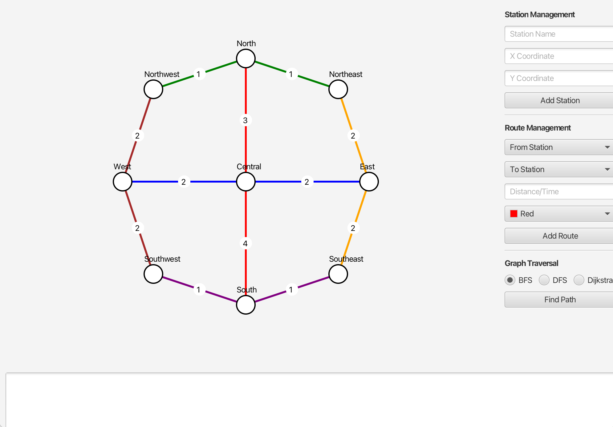

# L10-TrolleyGraphLab

## Graph Construction

In `TrolleyGraph` follow the // todo: statements in the Graph Construction category to implement a basic graph.

When complete, you should see a series of stations like this:

## Adjacency List

In `TrolleyGraph` continue to follow the // todo: statements to build an adjacency list.

When complete, you should see connected stations like this:

## Implement a Breadth First Search

In `TrolleyGraph` implement a Breadth First Search (BFS) algorithm either iteratively or recursively.

#### 1) Create a queue and enqueue start
#### 2) Mark start as visted
#### 3) While queue is not empty:
#### &nbsp;&nbsp; A) Dequeue a node
#### &nbsp;&nbsp; B) If the node is the end, reconstructPath
#### &nbsp;&nbsp; C) For each neighbor, if not visited:
#### &nbsp;&nbsp;&nbsp;&nbsp;&nbsp;&nbsp; a) mark visited & store in the parentMap
#### &nbsp;&nbsp;&nbsp;&nbsp;&nbsp;&nbsp; a) enqueue
#### List<String> reconstructPath(Map<String, String> parentMap, String start, String end)
#### Calculate the Big O()
(Tip: use V for vertices and E for edges!)

When complete, you should be able to run the BFS and see this result:

## Implement a Depth First Search

In `TrolleyGraph` implement a Depth First Search (DFS) algorithm that functions recursively.

#### 1) Create an empty stack and push start
#### 2) While stack is not empty:
#### &nbsp;&nbsp; A) Pop the node from the stack
#### &nbsp;&nbsp; B) If the node is the end, reconstructPath
#### &nbsp;&nbsp; C) If not visited, mark visited & store in the parentMap
#### &nbsp;&nbsp; D) For each neighbor, if not visited, recursively run DFS
#### List<String> reconstructPath(Map<String, String> parentMap, String start, String end)
#### Calculate the Big O()

When complete, you should see a result like this:

## Implement Dijkstra's Algorithm to find the nearest station!

In `TrolleyGraph` implement a Dijkstra's Algorithm.

#### 1) Cache all distances in an array
#### 2) Set distance start = 0; all others = ∞, enqueue start
#### 3) While priority queue (min-heap) is not empty:
#### &nbsp;&nbsp; A) Pop a node from the heap
#### &nbsp;&nbsp; B) If the node's distance is less than the current shortest for that node:
#### &nbsp;&nbsp;&nbsp;&nbsp; a) recalculate distances for neighbors and if shorter than previously found:
#### &nbsp;&nbsp;&nbsp;&nbsp; b) push neighbors to the heap
#### 4) Rebuild the parentMap using the shortest paths discovered
#### List<String> reconstructPath(Map<String, String> parentMap, String start, String end)

#### Calculate the Big O() 

When complete, you should see a result that looks like this:

## Boss Mode Goals (Expand the Fun! Optional, but you will get bonus points)

Reconfigure your trolley setup to match the MTS Trolley System in San Diego! Which algorithm is best at handling San Diego trolley planning?

